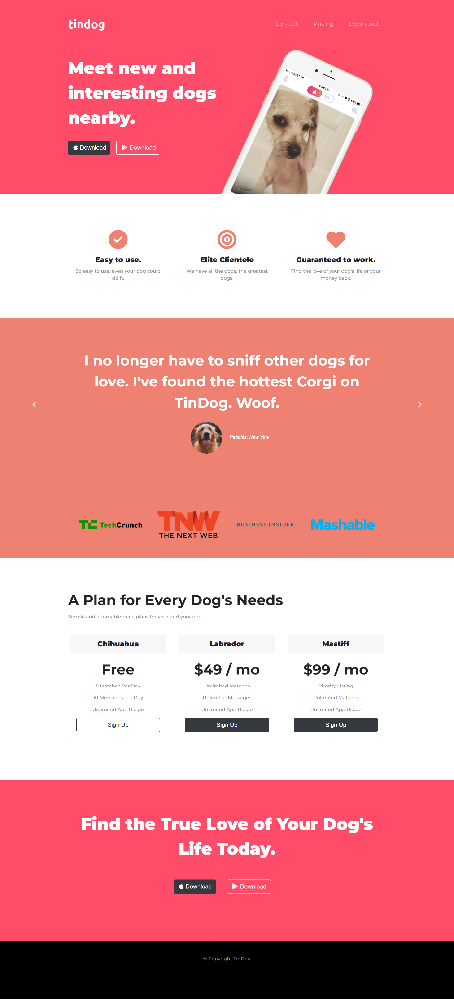

# Bootstrap-Project---Responsive-Web-Design
This project is a fully responsive web page built using the Bootstrap framework as part of a Udemy course practice project. The objective was to enhance my skills in responsive design and learn how to quickly style elements using Bootstrap components.

Features:
Mobile-first design with Bootstrap's grid system
Navbar, cards, and buttons styled using Bootstrap classes
Custom CSS for additional styling
Fully responsive layout that adapts to different screen sizes

Technologies Used:
HTML5 for structuring the content.
Bootstrap 5 for responsive design and pre-built components.
CSS3 for additional custom styling.

How to Use:
Clone or download the repository.
Open the index.html file in any modern web browser to view the web page.
Project Screenshot:

